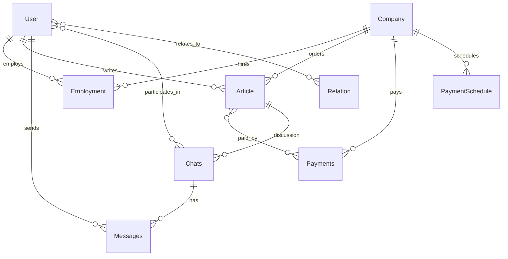

# Requirements

## Style Guide

- Use `#` for the document title, `##` for main sections, `###` for subsections, and add additional `#` for deeper levels.
- Number ordered lists sequentially.
- Keep a single blank line between sections and paragraphs.

## Idea

Platform for controlling freelance jobs for copywriting from different companies.
User registers account, after this he has the right to add info about current, future, and past tasks for writing articles (copywriting).

## Name

- First version "Copy hopper"

## Entities

Main entities in DB:

- User
- Client/Company
- Employment
- Article
- Payments
- Payment Schedule
- Messages
- Chats
- Relation

### User

Person who receives the job to write text from some company and tracks progress on tasks.

#### Fields

| Field | Type | Constraints |
| ----- | ---- | ----------- |
| id | UUID | primary key |
| email | VARCHAR(255) | not null, unique |
| full_name | VARCHAR(255) | not null |
| display_name | VARCHAR(255) | |
| gender | VARCHAR(20) | |
| birthdate | DATE | |
| photo_url | TEXT | |
| languages_write | TEXT[] | |
| languages_read | TEXT[] | |
| native_language | VARCHAR(10) | |

#### Relationships

- One-to-many with **Employment** (user has many employments).
- One-to-many with **Article** as owner.
- One-to-many with **Article** as contractor.
- One-to-many with **Message** (sender).
- Many-to-many with **Chat** through a join table `chat_users`.
- Many-to-many with **Relation** (user-to-user links).

#### Indexes

- Unique index on `email`.
- Index on `display_name` for searching.

### Client/Company

Entity that gives tasks to write articles and pays on some platform. Can be shared between users.

#### Fields

| Field | Type | Constraints |
| ----- | ---- | ----------- |
| id | UUID | primary key |
| name | VARCHAR(255) | not null, unique |
| website | TEXT | |
| logo | TEXT | |
| logo_with_name | TEXT | |
| square_logo | TEXT | |
| business_area | VARCHAR(255) | |
| topics | TEXT[] | |
| writing_tags | TEXT[] | |
| summary | TEXT | |

#### Relationships

- One-to-many with **Employment** (company employs many users).
- One-to-many with **Article** (orders many articles).
- One-to-many with **Payments**.
- One-to-many with **Payment Schedule**.

#### Indexes

- Unique index on `name`.
- Index on `business_area`.

### Employment

Connection between user and company for a period of time. Users can work in the same company for multiple periods.

#### Fields

| Field | Type | Constraints |
| ----- | ---- | ----------- |
| id | UUID | primary key |
| company_id | UUID | not null, foreign key → Company.id |
| user_id | UUID | not null, foreign key → User.id |
| start_date | DATE | not null |
| finish_date | DATE | |
| type | VARCHAR(20) | not null (full-time, part-time, freelance) |

#### Relationships

- Many-to-one with **Client/Company**.
- Many-to-one with **User**.

#### Indexes

- Index on `user_id`.
- Index on `company_id`.
- Unique composite index on (`user_id`, `company_id`, `start_date`).

### Article

Main piece of system. Users write articles for companies.

#### Fields

| Field | Type | Constraints |
| ----- | ---- | ----------- |
| id | UUID | primary key |
| name_target | VARCHAR(255) | not null |
| name_english | VARCHAR(255) | |
| type | VARCHAR(50) | not null |
| language_main | VARCHAR(10) | not null |
| language_origin | VARCHAR(10) | |
| task_link | TEXT | |
| work_link | TEXT | |
| published_link | TEXT | |
| allowed_to_share | BOOLEAN | default false |
| summary_en | TEXT | |
| status | VARCHAR(20) | not null |
| created_at | TIMESTAMP | not null |
| deadline_at | TIMESTAMP | |
| finished_at | TIMESTAMP | |
| published_at | TIMESTAMP | |
| last_updated_at | TIMESTAMP | |
| payment_rate | DECIMAL(10,2) | |
| company_id | UUID | not null, foreign key → Company.id |
| owner_id | UUID | not null, foreign key → User.id |
| contractor_id | UUID | foreign key → User.id |
| contractor_rate | DECIMAL(5,2) | |

#### Relationships

- Many-to-one with **Client/Company**.
- Many-to-one with **User** as owner.
- Many-to-one with **User** as contractor (optional).
- Many-to-many with **Payments** through `payment_articles`.
- One-to-one/optional with **Chat** (article chat).

#### Indexes

- Index on `company_id`.
- Index on `owner_id`.
- Index on `status`.

### Payments

Tracks payments from companies for texts.

#### Fields

| Field | Type | Constraints |
| ----- | ---- | ----------- |
| id | UUID | primary key |
| value | DECIMAL(10,2) | not null |
| currency | CHAR(3) | not null |
| platform | VARCHAR(100) | |
| company_id | UUID | not null, foreign key → Company.id |
| paid_at | DATE | not null |

#### Relationships

- Many-to-one with **Client/Company**.
- Many-to-many with **Article** through `payment_articles`.

#### Indexes

- Index on `company_id`.
- Index on `paid_at`.

### Payment Schedule

Defines when a company usually pays for texts.

#### Fields

| Field | Type | Constraints |
| ----- | ---- | ----------- |
| id | UUID | primary key |
| company_id | UUID | not null, foreign key → Company.id |
| currency | CHAR(3) | not null |
| platform | VARCHAR(100) | |
| usual_rate | DECIMAL(10,2) | |
| date_template | INT[] | days of month |

#### Relationships

- Many-to-one with **Client/Company**.

#### Indexes

- Index on `company_id`.

### Messages

Every user can write messages to another user in private or in the context of an article.

#### Fields

| Field | Type | Constraints |
| ----- | ---- | ----------- |
| id | UUID | primary key |
| chat_id | UUID | not null, foreign key → Chat.id |
| sender_id | UUID | not null, foreign key → User.id |
| content | TEXT | not null |
| created_at | TIMESTAMP | not null |

#### Relationships

- Many-to-one with **Chat**.
- Many-to-one with **User** (sender).

#### Indexes

- Index on `chat_id`.
- Index on `created_at`.

### Chats

Several users on any topic or connected to a particular article. Finished article chats should be archived.

#### Fields

| Field | Type | Constraints |
| ----- | ---- | ----------- |
| id | UUID | primary key |
| topic | VARCHAR(255) | |
| article_id | UUID | foreign key → Article.id |

#### Relationships

- Many-to-many with **User** through `chat_users`.
- One-to-many with **Messages**.
- Many-to-one with **Article** (optional).

#### Indexes

- Index on `article_id`.

### Relation

Relations between users.

#### Fields

| Field | Type | Constraints |
| ----- | ---- | ----------- |
| id | UUID | primary key |
| source_user_id | UUID | not null, foreign key → User.id |
| target_user_id | UUID | not null, foreign key → User.id |
| type | VARCHAR(20) | not null (friend, boss, contractor, both, none) |

#### Relationships

- Many-to-one with **User** (source).
- Many-to-one with **User** (target).

#### Indexes

- Unique composite index on (`source_user_id`, `target_user_id`).

### Schema Overview

| Entity | Primary Key | Key Foreign Keys | Notes |
| ------ | ----------- | ---------------- | ----- |
| User | id | - | |
| Client/Company | id | - | |
| Employment | id | company_id → Company.id, user_id → User.id | Link between user and company |
| Article | id | company_id → Company.id, owner_id → User.id, contractor_id → User.id | |
| Payments | id | company_id → Company.id | Uses `payment_articles` to link articles |
| Payment Schedule | id | company_id → Company.id | |
| Messages | id | chat_id → Chat.id, sender_id → User.id | |
| Chats | id | article_id → Article.id | Uses `chat_users` for participants |
| Relation | id | source_user_id → User.id, target_user_id → User.id | |

## Case Scenarios

### Articles (by user or contractor)

#### Create Text Article

1. User logs in to system via web page using Google account (for now)
2. At first he doesn’t have any text to write and track
3. He receives externally task and then needs to put it down here in system
4. He clicks some button to add new Article task
5. Fills all necessary fields
6. If there is no company - we need first to create one (see Create company/employment)

#### Update Text Article

1. Add more info about it
2. Change status of article

### Company (any user - think how to do it)

#### Create Company

- **User actions:** User selects "Add Company" and fills in name, website, logos, and other optional fields, then submits.
- **System validations and responses:** Validate required fields and ensure the company name is unique. If validation fails, display specific error messages.
- **Success:** Company record is created and becomes available for selection in article and employment forms. A confirmation notification is shown.
- **Failure:** Form remains open with validation errors highlighted; duplicate name or missing fields are reported.

#### Read Company

- **User actions:** User searches or opens a company from the list.
- **System validations and responses:** Verify the user has permission to view company details, then retrieve data from the database.
- **Success:** Company information and related statistics are displayed.
- **Failure:** If the company does not exist or access is denied, an error notification is shown.

#### Update Company

- **User actions:** User edits company details and saves changes.
- **System validations and responses:** Validate updated fields and ensure the new name remains unique.
- **Success:** Changes are stored and a success message is displayed.
- **Failure:** Errors are shown for invalid data or conflicts.

#### Delete Company

- **User actions:** User requests company deletion and confirms the action.
- **System validations and responses:** Check for associated articles, employments, or payments. If linked records exist, deletion is blocked and the user is prompted to reassign or remove dependencies.
- **Success:** If no dependencies exist, the company is removed and a confirmation is shown.
- **Failure:** Warning is displayed explaining why the company cannot be deleted.

### Employment (by user)

#### Create Employment with company

#### Update Employment with company

1. Set finish date
2. Set rate

### Payment (by user)

#### Create Payment

- **Register payment from some company**
  - **User actions:** User selects the hiring company, inputs amount, date, and related article, then submits.
  - **System validations and responses:** Ensure the company exists, amount is positive, article belongs to the user, and all required fields are filled. Display validation errors for any issues.
  - **Success:** Payment record is saved and linked to the appropriate company and articles. A success notification is shown.
  - **Failure:** Payment is not saved; errors are displayed.

- **Register transfer to contractor**
  - **User actions:** User selects the contractor, links the payment, enters transfer amount, and submits.
  - **System validations and responses:** Confirm the contractor is assigned to the article and that the transfer amount does not exceed the remaining payment balance.
  - **Success:** Transfer is recorded and both parties receive a notification.
  - **Failure:** Operation is blocked with an explanatory error.

#### Read Payment

- **User actions:** User browses payments list or opens a specific payment.
- **System validations and responses:** Verify user permissions and fetch payment details.
- **Success:** Payment data, including associated articles and transfers, is displayed.
- **Failure:** Notification is shown if payment cannot be found or the user lacks access.

#### Update Payment

- **Modify payment**
  - **User actions:** User edits payment details or adjusts transfer amounts and saves.
  - **System validations and responses:** Validate changes, ensuring amounts remain consistent with existing transfers.
  - **Success:** Updated information is saved and a confirmation message appears.
  - **Failure:** Validation errors are displayed and changes are not persisted.

#### Delete Payment

- **User actions:** User selects delete on a payment and confirms.
- **System validations and responses:** Check for associated approved transfers or reports; prevent deletion if such links exist.
- **Success:** Payment is removed and the user is notified.
- **Failure:** Deletion is denied with an explanation.

### Payment Schedule (by user)

#### Create Payment Schedule

- **User actions:** User selects a company, defines payment periods or milestones, sets amounts and due dates, then saves.
- **System validations and responses:** Verify company exists, dates are valid, and no overlapping schedule for the same company.
- **Success:** Schedule is created and reminders are scheduled; success notification is shown.
- **Failure:** Validation errors displayed; schedule not saved.

#### Read Payment Schedule

- **User actions:** User views list or details of payment schedules.
- **System validations and responses:** Check permissions; retrieve schedule and related payments.
- **Success:** Schedule details are displayed with upcoming milestones.
- **Failure:** Error notification if schedule cannot be accessed.

#### Update Payment Schedule

- **User actions:** User modifies existing schedule entries and saves.
- **System validations and responses:** Ensure new data does not conflict with issued payments or other schedules.
- **Success:** Updates stored and confirmation shown.
- **Failure:** System displays validation messages.

#### Delete Payment Schedule

- **User actions:** User requests deletion of a schedule.
- **System validations and responses:** Check for linked payments; block if payments exist.
- **Success:** If no dependencies, schedule is removed and user is notified.
- **Failure:** Deletion refused with explanation of linked payments.

### User

#### Create User

- **User actions:** User registers via Google or a sign-up form providing email and profile details.
- **System validations and responses:** Verify email format and uniqueness, validate authentication token.
- **Success:** Account is created and a welcome notification is sent.
- **Failure:** Registration fails with descriptive errors.

#### Read User

- **User actions:** User views their profile or searches for other users.
- **System validations and responses:** Check access permissions and retrieve profile data.
- **Success:** Requested profile information is displayed.
- **Failure:** Error shown if user not found or access denied.

#### Update User

- **User actions:** User edits profile fields such as name, photo, or languages and submits.
- **System validations and responses:** Validate inputs and ensure email uniqueness when changed.
- **Success:** Updated profile is saved and confirmation is displayed.
- **Failure:** Validation errors prevent saving.

#### Delete User

- **User actions:** User requests account deletion and confirms.
- **System validations and responses:** Verify user identity and ensure no active articles or employments.
- **Success:** Account is removed or deactivated; confirmation sent.
- **Failure:** Deletion blocked with reason provided.

### Auth

#### Messages (by user)

##### Chat Lifecycle

###### Create Chat

- **User actions:** User starts a new chat from an article or by selecting participants and sends an initial message.
- **System validations and responses:** Verify participants exist and user has rights to create the chat; prevent duplicate chats for the same article and participants.
- **Success:** Chat room is created and participants receive notifications.
- **Failure:** Error message indicates missing permissions or validation issues.

###### Read Chat

- **User actions:** User opens chat list or selects a chat to view.
- **System validations and responses:** Confirm user is a participant and fetch messages.
- **Success:** Chat messages are displayed in chronological order.
- **Failure:** Access is denied with notification.

###### Update Chat

- **User actions:** User renames chat or adds/removes participants.
- **System validations and responses:** Ensure user has manage rights and new participants exist.
- **Success:** Chat settings updated and participants notified.
- **Failure:** Operation rejected with error message.

###### Delete Chat

- **User actions:** User archives or deletes a chat.
- **System validations and responses:** Confirm authorization and warn about message loss.
- **Success:** Chat is removed or archived; participants notified.
- **Failure:** Deletion blocked with explanation.

##### Message Lifecycle

###### Create Message

- **User actions:** User composes and sends a message within a chat.
- **System validations and responses:** Verify user is a participant, message is not empty, and attachments are allowed.
- **Success:** Message is saved and delivered; recipients are notified.
- **Failure:** Error is shown and message is not sent.

###### Read Message

- **User actions:** User views messages in an open chat.
- **System validations and responses:** Confirm membership and mark messages as read.
- **Success:** Messages are displayed and read receipts updated.
- **Failure:** Access denied or error shown.

###### Update Message

- **User actions:** User edits a previously sent message within allowed time.
- **System validations and responses:** Check that user is the author and within editable timeframe.
- **Success:** Message content updated with edit indicator.
- **Failure:** Edit blocked with error message.

###### Delete Message

- **User actions:** User deletes their own message.
- **System validations and responses:** Verify author identity and time constraints.
- **Success:** Message removed or replaced with deletion notice; notification optional.
- **Failure:** System rejects deletion with explanation.

#### Relations (by user)

##### Create Relation

- **User actions:** User searches for another user, selects relation type (e.g., friend, colleague), and sends request.
- **System validations and responses:** Ensure target user exists and relation is not already established.
- **Success:** Relation is created (or request sent) and both users are notified.
- **Failure:** Error is displayed if relation already exists or target not found.

##### Read Relation

- **User actions:** User views list of relations or details about a specific relation.
- **System validations and responses:** Confirm permission to view relation data.
- **Success:** Relation information is presented.
- **Failure:** Message shows relation not found or access denied.

##### Update Relation

- **User actions:** User changes relation type or status.
- **System validations and responses:** Verify user is part of the relation.
- **Success:** Relation is updated and notifications sent if appropriate.
- **Failure:** Update is rejected with an error.

##### Delete Relation

- **User actions:** User removes the relation.
- **System validations and responses:** Confirm the user is part of the relation and no dependent records exist.
- **Success:** Relation removed and the other user is notified.
- **Failure:** Deletion fails with an explanatory message.

## Architecture

1. PostgreSQL database with Flyway migrations
2. Backend Java/Spring
3. Frontend React/TypeScript
4. App (android/IOS) for later
5. DB, backend and frontend are in cloud (AWS)
6. Backend starts as a modular monolith with clear module boundaries
   to simplify initial development and deployment.
7. Extra Frontend for each user with different personal domain and design with just portfolio

### Service Approach

The backend is delivered as a single monolithic application with internal modules for:

- **Payments**
- **Articles**
- **Messaging**

Splitting into dedicated microservices will be considered when:

- A module requires independent scaling or specialized infrastructure.
- Separate teams can own modules autonomously.
- Release cycles diverge enough to benefit from isolated deployment.

### Authentication and Authorization

- OAuth2 with JWT tokens for stateless sessions.
- User roles:
  - **User:** manages personal articles, messages, and relations.
  - **Company Manager:** oversees company articles and payments.
  - **Admin:** full platform access and management.
- External identity providers: Google and GitHub OAuth.
- Password policy: minimum 12 characters with upper/lowercase letters, number, and symbol.
- Authorization enforced on:
  - Article endpoints (`/api/articles/**`)
  - Payment endpoints (`/api/payments/**`)
  - Chat endpoints (`/api/chats/**` and `/api/messages/**`)
  - Admin module (`/api/admin/**`)

### Database

#### Backup and Restore

- Automated daily snapshots using Amazon RDS with point-in-time recovery.
- Before major schema changes, trigger manual backups and verify restore procedures.

#### Schema Management

- Manage schema versions with Flyway migrations stored in version control.
- Apply migrations automatically during deployment to keep environments synchronized.

#### Rationale

- PostgreSQL provides strong SQL compliance, JSON support, and mature ecosystem.
- Amazon RDS offers managed PostgreSQL hosting with automated backups and scaling options.
- Team members have prior experience with PostgreSQL and Flyway, reducing onboarding time.

## Features

1. Registring and tracking workflow of articles from different companies while working basicly as a freelancer
2. Controling deadlines of articles
3. planning and balancing calendar of work
4. if too much work you can delegate work for contractor and later share payment
5. control and track payments
6. browse finished work
7. API for portfolio site
8. notifications for close deadlines (in site and later in app)
9. beautiful portfolio with all info from site
10. powerful tool to manage work, and using data for portfolio
11. mark finished text as pulic or not, it depends if it goes to public portfolio
12. support of different languages of interface and content
13. Admin panel for managing everything
14. Stats per months with text and money
15. Chatting with colleages (friends)
16. Invite for friends with any social media or link
17. Search for existing people and set relations
