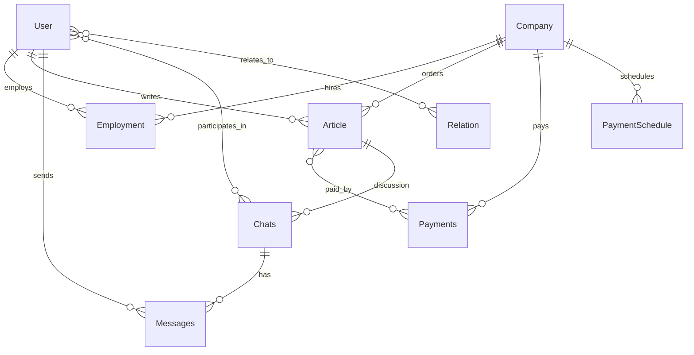

Idea:  
Platform for controlling freelance jobs for copywriting from different companies.  
User registers account, after this he has the right to add info about current, future, and past tasks for writing articles (copywriting).

## Name
 - First version "Copy hopper"

## Entities

Main entities in DB:
- User
- Client/Company
- Employment
- Article
- Payments
- Payment Schedule
- Messages
- Chats
- Relation

### User
Person who receives the job to write text from some company and tracks progress on tasks.

#### Fields
| Field | Type | Constraints |
| ----- | ---- | ----------- |
| id | UUID | primary key |
| email | VARCHAR(255) | not null, unique |
| full_name | VARCHAR(255) | not null |
| display_name | VARCHAR(255) | |
| gender | VARCHAR(20) | |
| birthdate | DATE | |
| photo_url | TEXT | |
| languages_write | TEXT[] | |
| languages_read | TEXT[] | |
| native_language | VARCHAR(10) | |

#### Relationships
- One-to-many with **Employment** (user has many employments).
- One-to-many with **Article** as owner.
- One-to-many with **Article** as contractor.
- One-to-many with **Message** (sender).
- Many-to-many with **Chat** through a join table `chat_users`.
- Many-to-many with **Relation** (user-to-user links).

#### Indexes
- Unique index on `email`.
- Index on `display_name` for searching.

### Client/Company
Entity that gives tasks to write articles and pays on some platform. Can be shared between users.

#### Fields
| Field | Type | Constraints |
| ----- | ---- | ----------- |
| id | UUID | primary key |
| name | VARCHAR(255) | not null, unique |
| website | TEXT | |
| logo | TEXT | |
| logo_with_name | TEXT | |
| square_logo | TEXT | |
| business_area | VARCHAR(255) | |
| topics | TEXT[] | |
| writing_tags | TEXT[] | |
| summary | TEXT | |

#### Relationships
- One-to-many with **Employment** (company employs many users).
- One-to-many with **Article** (orders many articles).
- One-to-many with **Payments**.
- One-to-many with **Payment Schedule**.

#### Indexes
- Unique index on `name`.
- Index on `business_area`.

### Employment
Connection between user and company for a period of time. Users can work in the same company for multiple periods.

#### Fields
| Field | Type | Constraints |
| ----- | ---- | ----------- |
| id | UUID | primary key |
| company_id | UUID | not null, foreign key → Company.id |
| user_id | UUID | not null, foreign key → User.id |
| start_date | DATE | not null |
| finish_date | DATE | |
| type | VARCHAR(20) | not null (full-time, part-time, freelance) |

#### Relationships
- Many-to-one with **Client/Company**.
- Many-to-one with **User**.

#### Indexes
- Index on `user_id`.
- Index on `company_id`.
- Unique composite index on (`user_id`, `company_id`, `start_date`).

### Article
Main piece of system. Users write articles for companies.

#### Fields
| Field | Type | Constraints |
| ----- | ---- | ----------- |
| id | UUID | primary key |
| name_target | VARCHAR(255) | not null |
| name_english | VARCHAR(255) | |
| type | VARCHAR(50) | not null |
| language_main | VARCHAR(10) | not null |
| language_origin | VARCHAR(10) | |
| task_link | TEXT | |
| work_link | TEXT | |
| published_link | TEXT | |
| allowed_to_share | BOOLEAN | default false |
| summary_en | TEXT | |
| status | VARCHAR(20) | not null |
| created_at | TIMESTAMP | not null |
| deadline_at | TIMESTAMP | |
| finished_at | TIMESTAMP | |
| published_at | TIMESTAMP | |
| last_updated_at | TIMESTAMP | |
| payment_rate | DECIMAL(10,2) | |
| company_id | UUID | not null, foreign key → Company.id |
| owner_id | UUID | not null, foreign key → User.id |
| contractor_id | UUID | foreign key → User.id |
| contractor_rate | DECIMAL(5,2) | |

#### Relationships
- Many-to-one with **Client/Company**.
- Many-to-one with **User** as owner.
- Many-to-one with **User** as contractor (optional).
- Many-to-many with **Payments** through `payment_articles`.
- One-to-one/optional with **Chat** (article chat).

#### Indexes
- Index on `company_id`.
- Index on `owner_id`.
- Index on `status`.

### Payments
Tracks payments from companies for texts.

#### Fields
| Field | Type | Constraints |
| ----- | ---- | ----------- |
| id | UUID | primary key |
| value | DECIMAL(10,2) | not null |
| currency | CHAR(3) | not null |
| platform | VARCHAR(100) | |
| company_id | UUID | not null, foreign key → Company.id |
| paid_at | DATE | not null |

#### Relationships
- Many-to-one with **Client/Company**.
- Many-to-many with **Article** through `payment_articles`.

#### Indexes
- Index on `company_id`.
- Index on `paid_at`.

### Payment Schedule
Defines when a company usually pays for texts.

#### Fields
| Field | Type | Constraints |
| ----- | ---- | ----------- |
| id | UUID | primary key |
| company_id | UUID | not null, foreign key → Company.id |
| currency | CHAR(3) | not null |
| platform | VARCHAR(100) | |
| usual_rate | DECIMAL(10,2) | |
| date_template | INT[] | days of month |

#### Relationships
- Many-to-one with **Client/Company**.

#### Indexes
- Index on `company_id`.

### Messages
Every user can write messages to another user in private or in the context of an article.

#### Fields
| Field | Type | Constraints |
| ----- | ---- | ----------- |
| id | UUID | primary key |
| chat_id | UUID | not null, foreign key → Chat.id |
| sender_id | UUID | not null, foreign key → User.id |
| content | TEXT | not null |
| created_at | TIMESTAMP | not null |

#### Relationships
- Many-to-one with **Chat**.
- Many-to-one with **User** (sender).

#### Indexes
- Index on `chat_id`.
- Index on `created_at`.

### Chats
Several users on any topic or connected to a particular article. Finished article chats should be archived.

#### Fields
| Field | Type | Constraints |
| ----- | ---- | ----------- |
| id | UUID | primary key |
| topic | VARCHAR(255) | |
| article_id | UUID | foreign key → Article.id |

#### Relationships
- Many-to-many with **User** through `chat_users`.
- One-to-many with **Messages**.
- Many-to-one with **Article** (optional).

#### Indexes
- Index on `article_id`.

### Relation
Relations between users.

#### Fields
| Field | Type | Constraints |
| ----- | ---- | ----------- |
| id | UUID | primary key |
| source_user_id | UUID | not null, foreign key → User.id |
| target_user_id | UUID | not null, foreign key → User.id |
| type | VARCHAR(20) | not null (friend, boss, contractor, both, none) |

#### Relationships
- Many-to-one with **User** (source).
- Many-to-one with **User** (target).

#### Indexes
- Unique composite index on (`source_user_id`, `target_user_id`).

### Schema Overview

| Entity | Primary Key | Key Foreign Keys | Notes |
| ------ | ----------- | ---------------- | ----- |
| User | id | - | |
| Client/Company | id | - | |
| Employment | id | company_id → Company.id, user_id → User.id | Link between user and company |
| Article | id | company_id → Company.id, owner_id → User.id, contractor_id → User.id | |
| Payments | id | company_id → Company.id | Uses `payment_articles` to link articles |
| Payment Schedule | id | company_id → Company.id | |
| Messages | id | chat_id → Chat.id, sender_id → User.id | |
| Chats | id | article_id → Article.id | Uses `chat_users` for participants |
| Relation | id | source_user_id → User.id, target_user_id → User.id | |

### Case Scenarios

## Articles (by user or contractor)

# Create Text article

1. User logs in to system via web page using Google account (for now)
2. At first he doesn’t have any text to write and track
3. He receives externally task and then needs to put it down here in system
4. He clicks some button to add new Article task
5. Fills all necessary fields
6. If There is no company \- we need first to create one first (see Create company/employmennt)

# Update Text Article

1. Add more info about it
2. Change status of article

## Company (any user - think how to do it)

# CRUD

1. What to do if there are some articles connected to the company???

## Employment (by user)

# Create Employment with company

# Update Employment with company

1. Set finish date
2. Set rate

## Payment (by user)

# Register payment from some company

# Modify payment

# Register transfer to contractor

# Modify payment

# CRUD

## Payment Schedule (by user)

# CRUD

## User

# CRUD

# auth

## messages (by user)

# CRUD for chat

# CRUD for messages

## Relations (by user)

# CRUD

### Architecture

1. SQL Database (still need to choose which one)
2. Backend Java/Spring
3. Frontend React/TypeScript
4. App (android/IOS) for later
5. DB, backend and frontend are in cloud (AWS)
6. Maybe backend should be several services - still need to plan
7. Extra Frontend for each user with different personal domain and design with just portfolio

### Features

1. Registring and tracking workflow of articles from different companies while working basicly as a freelancer
2. Controling deadlines of articles
3. planning and balancing calendar of work
4. if too much work you can delegate work for contractor and later share payment
5. control and track payments
6. browse finished work
7. API for portfolio site
8. notifications for close deadlines (in site and later in app)
9. beautiful portfolio with all info from site
10. powerful tool to manage work, and using data for portfolio
11. mark finished text as pulic or not, it depends if it goes to public portfolio
12. support of different languages of interface and content
13. Admin panel for managing everything
14. Stats per months with text and money
15. Chatting with colleages (friends)
16. Invite for friends with any social media or link
17. Search for existing people and set relations
